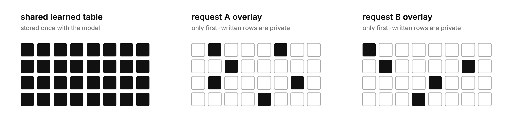

# Copy-on-Write SDM

## Intuition

Dense attention preserves token-level history, but its per-request KV state
grows with context and limits serving concurrency. Compact recurrent mixers
bound that state by compressing history into a small fixed workspace, but that
bound is also a capacity ceiling. [Sparse Delta Memory
(SDM)](https://arxiv.org/abs/2607.07386) supplies a useful third design point:
a much larger addressable recurrent memory that reads and writes only a few
rows per token.

An SDM layer replaces its token-growing KV cache with a fixed `N × D` table for
every request. Increasing `N` to expose more address space therefore increases
every user's SDM state, even when most rows never change. Sparse reads and
writes reduce work, not the allocated table. The opportunity is to separate
logical capacity from physical per-request allocation.

An SDM row is identical across requests until a request first writes it. The
learned initial table can therefore remain shared with the model while each
request materializes only its own changes. A request can see a large logical
memory while paying only for the rows it actually uses.

## Experiment

SDM's [released inference path](https://github.com/facebookresearch/sparse-delta-memory/blob/183e7df809131b80ad4393741029d0f20fc3640b/lingua/sparse_delta_memory/layer.py#L1078-L1105)
begins each sequence with a private copy of every row. We replace that eager
copy with an exact copy-on-write representation:

```text
read untouched i  → shared M₀[i]
first write to i  → copy M₀[i], then apply the SDM update
later write to i  → update the same private row
```

For `L` SDM layers, `H` memory heads, `N` rows, width `D`, and `Uₜ` rows first
written by a request through position `t`, private value state changes from
`Θ(LHND)` to `Θ(UₜD)`. The shared learned table remains model state, while a
small `Θ(LHN)` integer map identifies which rows have become private.



We first trained a seven-SDM-layer, one-attention-layer model on the complete
65.536-million-token WikiText-103 schedule and counted the exact union of its
hard top-four write addresses over 64 validation sequences. Each SDM layer had
`N=256`, top-16 reads, width 128, and one memory head. A separate CUDA screen
then compared dense-table serving with the exact packed representation under
matched routes.

## Implementation

Training is unchanged. Prefill executes SDM's ordinary full-prefix recurrence,
records the union of hard-written addresses, and packs only those terminal rows
into private state. Decode starts from that packed handoff. This preserves the
efficient training path and exact SDM semantics, but it also means the result is
about retained serving state rather than eliminating dense temporary prefill
scratch.

[`PackedSDMCopyOnWriteState`](copy_on_write_sdm/allocator.py) backs every logical SDM
bank in one layer with a shared contiguous FP32 value slab. Each live request
keeps a dense int32 logical-to-physical map initialized to `-1`; the layer also
keeps a shared free-row stack. A selected read follows the map to either private
state or the model's shared `M₀`. On first write, the fused Triton kernel pops a
physical row, loads its value from `M₀`, applies the original gated-delta update,
and stores the result. Repeated writes reuse that row.

The implementation required more than packing the table. A fixed future reserve
saved occupied rows but left much of the physical reservation in place, while a
separate first-touch resolver made narrow decode launch-bound. The final path
proves capacity before each fused step, combines allocation with SDM's update
and read, and grows the layer-wide slab in pooled quanta to amortize the copy
when headroom runs out.
[`inference.py`](copy_on_write_sdm/inference.py) implements prefill handoff, decode,
release, survivor compaction, admission, and trimming;
[`benchmark_serving.py`](experiments/benchmark_serving.py) contains the matched
dense-versus-packed lifecycle and timing experiment.

## Result

| Prefix | Private rows | Logical rows | SDM value-state reduction |
|---:|---:|---:|---:|
| 16 | 185.4 | 1,792 | 89.65% |
| 256 | 524.8 | 1,792 | 70.71% |
| 2,048 | 661.1 | 1,792 | 63.11% |

At 2,048 tokens, a request used 661.1 rows on average and 687 at most. The
trained model reached test NLL 5.45160.

In the synthetic random-route A40 screen, the four-step growth policy
produced:

| Batch | Logical rows not materialized | Allocated serving-state reduction | Decode latency cost | Packed throughput |
|---:|---:|---:|---:|---:|
| 1 | 55.97% | 49.48% | +7.08% | 117 tokens/s |
| 16 | 54.25% | 47.73% | +8.04% | 1,748 tokens/s |
| 64 | 54.75% | 47.73% | +6.70% | 7,017 tokens/s |

The first percentage is working-set sparsity: the share of logical SDM rows that
never became request-private. The second is the measured reduction in allocated
per-request bytes after pooled headroom, the logical map, allocator metadata,
and dense KV are included. Shared `M₀` remains model state and is excluded from
both sides.

At batch 64, growing one step at a time saved 50.81% of allocated state but
triggered 110 growths and copied 609,792 existing value rows. Four-step growth
saved 47.73%, triggered 28 growths, and copied 157,696 rows. The larger quantum
therefore spent 3.08 percentage points of memory reduction to cut allocator
growth and copying by roughly fourfold; its measured 6.70% latency cost already
includes those copies.

A continuous-batching check released two of four requests, returned 144 rows to
the shared pools, compacted the survivors, and admitted two new requests. The
packed and dense controls retained exactly matching FP32 state, with output
maximum difference zero.

## Why it matters

Logical capacity no longer has to equal every user's physical allocation.
Requests pay only for rows that diverge from shared initialization. The
implementation preserves SDM semantics: FP32 mutable state matches the dense
table exactly, and BF16 outputs agree within rounding tolerance.

### Future work: maps for very large address spaces

The current direct map uses one int32 entry per logical slot and request bank,
or `Θ(LHN)` metadata. It is 7 KiB per request in the tested seven-layer,
`N=256` model and is already included in the allocated-state result above. It is
not a material bottleneck here, but a sparse or paged map would keep metadata
from becoming significant if the logical address space grows by orders of
magnitude.

## Reproduction

Python 3.11–3.13, PyTorch 2.8, and a CUDA GPU are required. From a clean checkout:

```bash
python3 -m pip install -e .
./reproduce.sh
```

The script verifies pinned WikiText-103, regenerates the exact stream, trains
the complete seed-0 arm, and benchmarks the allocator. On an A40, expect about
1.5 hours, under $1 at the historical $0.44/hour rate, and 1.2 GB of local data.
Fresh tables appear under `runs/reproduction/measurements/`; the run fails on
causality, state-parity, loss, occupancy, or allocator regressions. Stages are
also available as `prepare`, `occupancy`, and `serving`.

Exact settings and provenance are in [APPENDIX.md](APPENDIX.md) and
[provenance.json](provenance.json).

## References

- Loïc Cabannes et al., [Sparse Delta Memory: Scaling the State of Linear RNNs through Sparsity](https://arxiv.org/abs/2607.07386), 2026.
- Stephen Merity et al., [Pointer Sentinel Mixture Models](https://arxiv.org/abs/1609.07843), 2016.
